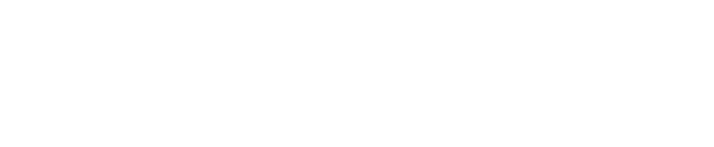

<h1> Hi! I'm Gabriel Otávio, software engineering student</h1>

<!-- Github Stats -->

  
  

 

<!-- About me -->

  <h2>🍕 About me</h2>

  
  
  

  

<!-- Links -->

  
  

 
<h2></h2>

<!-- Languages & Technologies -->

		<h4>Languages & Technologies</h4>
    
    
    
    

    

    

